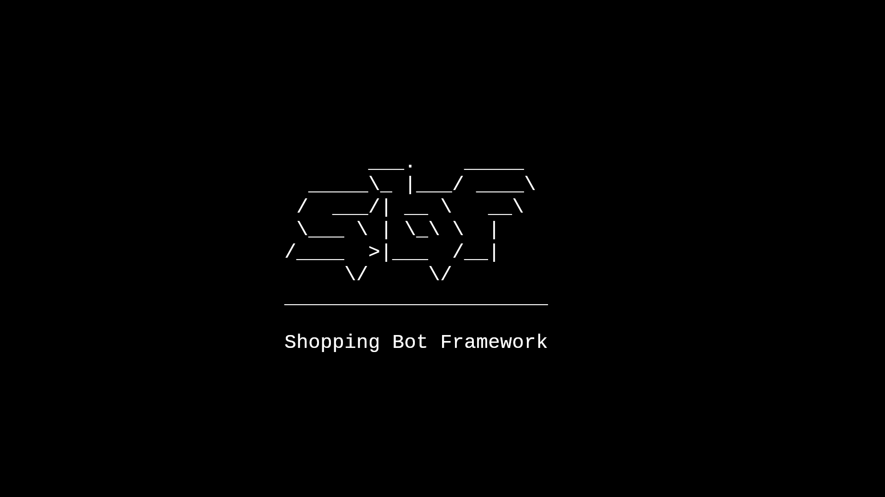

<p align="center"><a href="https://github.com/d-Raco/shopping-bot-framework"></a></p>

<p align="center">
  <a href="#"></a>
  <a href="#"></a>
  <a href="#"></a>
  <a href="#"></a>
  <a href="#"></a>
</p>

# shopping-bot-framework

Modular bot for checking and purchasing stock in online stores.

## Table of Contents

[shopping-bot-framework](https://github.com/d-Raco/shopping-bot-framework#shopping-bot-framework)
+ [Table of Contents](https://github.com/d-Raco/shopping-bot-framework#table-of-contents)
+ [Introduction](https://github.com/d-Raco/shopping-bot-framework#introduction)
+ [Motivation](https://github.com/d-Raco/shopping-bot-framework#motivation)
+ [Features](https://github.com/d-Raco/shopping-bot-framework#features)
+ [Requirements](https://github.com/d-Raco/shopping-bot-framework#requirements)
+ [Usage](https://github.com/d-Raco/shopping-bot-framework#usage)
+ [File Structure](https://github.com/d-Raco/shopping-bot-framework#file-structure)
+ [Development Guide](https://github.com/d-Raco/shopping-bot-framework#development-guide)
  - [Website Module](https://github.com/d-Raco/shopping-bot-framework#website-module)
  - [Alert Module](https://github.com/d-Raco/shopping-bot-framework#alert-module)
  - [Action](https://github.com/d-Raco/shopping-bot-framework#action)
+ [ToDos](https://github.com/d-Raco/shopping-bot-framework#todos)

## Introduction

This project implements a bot to check the availability of products online and pyurchase them. It uses a different module for each website to allow more flexibility when developing for a specific website. It also implements different alert modules to perform different actions when there is a change in the stock of a product or when it has been purchased.

## Motivation

I developed this bot to be able to buy products that are impossible to buy in other circumstances due to low stock or scalpers using the bots to buy the stock and then resell it to make a profit. For this reason, this bot has been developed to only buy 1 unit of a specific product.

## Features

- Highly flexibile
- Highly modular
- Highly customizable
- Easy integration with different websites
- Easy integration with different alerts
- Can search for different products at the same time
- Allows several actions, like `check` (check availability) or `buy` (buy product).
- Only buys 1 unit of a specific product
- Since it uses Selenium, it can execute JavaScript, which ensures that it will be able to load most web pages.
- You can specify the amount of time to wait until the stock is checked again.

## Requirements

- Python
- PIP
- Selenium
- [Geckodriver](https://github.com/mozilla/geckodriver/releases)

To access websites, this script uses Selenium. To install it, you can follow [this guide](https://www.selenium.dev/selenium/docs/api/py/). In essence, you just need to install Selenium using the following command:

```bash
pip install -U selenium
```

Then, download the [geckodriver](https://github.com/mozilla/geckodriver/releases) (which is the one used by this project) and put it in your PATH.

## Usage

Make sure you comply with the [Requirements](https://github.com/rymond3/shopping-bot-framework#requirements).

Download this repository. In the file called `globals.py` you have to set your variables:
- `time_interval`: specifies the number of seconds to wait until checking the stock again.
- `webmodules`: specifies the webmodule to use based on the start of the url. Do not change this unless you develop a new module.
- `alertmodules`: specifies the alertmodule to use based on the specified action. Do not change this unless you develop a new module.
- `productlist`: List of URLs to check. Depending on the domain name, the specific module will be called by the bot. The list is made up of tuples:
  - The first element is an index that identifies a specific product. This is used to check multiple products at once.
  - The second element is a URL where the specific product is sold.
  - The third element of the tuple is the action to perform. The 'buy' action buys the product, and 'check' action only checks if the specific product is in stock. If a specific product is purchased on one domain, that product will not be purchased or checked on any of the other domains in the list.

An example of `globals.py` would be:

```python
def init_globals():
    global time_interval
    time_interval = 5 * 60 # wait for 5 minutes

    global webmodules
    webmodules = {
        'https://www.example1': 'example1',
        'https://www.example2': 'example2',
        'https://www.example3': 'example3'
    }

    global alertmodules
    alertmodules = {
        'check': 'simple_print',
        'buy': 'open_url'
    }

    global product_list
    product_list = [
        (0, 'https://www.example1.com/product0', 'check'),
        (0, 'https://www.example2.com/product0', 'buy'),
        (0, 'https://www.example3.net/product0', 'check'),
        (1, 'https://www.example1.de/product1', 'buy'),
        (1, 'https://www.example3.com/product1', 'buy'),
        (2, 'https://www.example2.com/product2', 'check')
    ]
```

## File Structure

```graphql
# Important project components
.
├── alert_modules - # Modules used to notify about stock changes
│   ├── __init__.py - # Imports all modules found on this folder
│   ├── open_url.py - # Opens a URL with the system default browser
│   └── simple_print.py - # Prints all important information
├── ascii.py - # Startup ASCII art
├── globals.py - # User specified variables
├── img - # README images
├── sbf.py - # Main script
├── web_modules - # Modules used depending on the webpage
│   ├── __init__.py - # Imports all modules found on this folder
│   └── ... - # Modules for different websites
└── web_utilities - # Some uilities
    └── browser.py - # Class used to manage a selenium webdriver
```

## Development Guide

Guide on how to develop different parts of the bot:

### Website module

To develop a new website module follow these steps:

1. Find a website that you want to develop a module for.
2. Add the beginning of its URL to `webmodules` dictionary inside `globals.py`. The value you specify in this dictionary element must be the name of the module you will create.
3. Create a file with the same name as the value of the dictionary element created in step 2 inside the folder `web_modules`.
4. Create a function called `check` (check stock availability), `buy` (buy product) and any additional action desired.
5. Develop these functions. They must return a boolean.
6. You can now freely add the URL of the product to `productlist` inside `globals.py`. Your module will be automatically called.

### Alert module

To develop a new alert module follow these steps:

1. Think of an alert behaviour that you want to develop.
2. Add the action that will use this module to `alertmodules` dictionary inside `globals.py`. The value you specify in this dictionary element must be the name of the module you will create.
3. Create a file with the same name as the value of the dictionary element created in step 2 inside the folder `alert_modules`.
4. Create a function called `check` (check stock availability), `buy` (buy product) and any additional action desired.
5. Develop these functions. They can have different behaviours based on the state of the stock.
6. You can now freely use the action tied to your alert. Specifying that action to a product in `productlist` inside `globals.py` will call your alert module if the action returned successfully.

### Action

To develop a new action follow these steps:

1. Think of an action that you want the bot to perform with specific URLs.
2. Add the action to `alertmodules` dictionary inside `globals.py` and specify a particular alert module that will be called when your action has been acomplished.
3. Create a function for your action in any module you want from `alert_modules` and `web_modules`. The methods must have the same name as the action.
4. Develop these function.
6. You can now freely add the action to any product found in `productlist` inside `globals.py`. Your action methods will be automatically called.

## ToDos

- [ ] Develop the `buy` action for all modules.
- [ ] Develop new modules for more websites.
